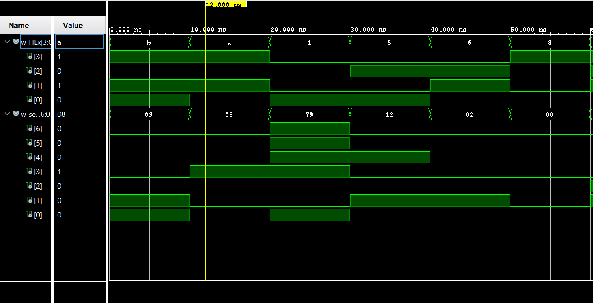

# Lab 2: Seven Segment Display Decoder

VHDL for ECE 281 [Lab 2](https://usafa-ece.github.io/ece281-book/lab/lab2.html)

Targeted toward Digilent Basys3. Tested Vivado 2024.2

C3C Elijah Sakamoto and I discussed how to write the proper code for the basys3 board.
We went over how to create the decoder, troubleshooting the test bench, and then
properly connecting the component to the basys3 board.
